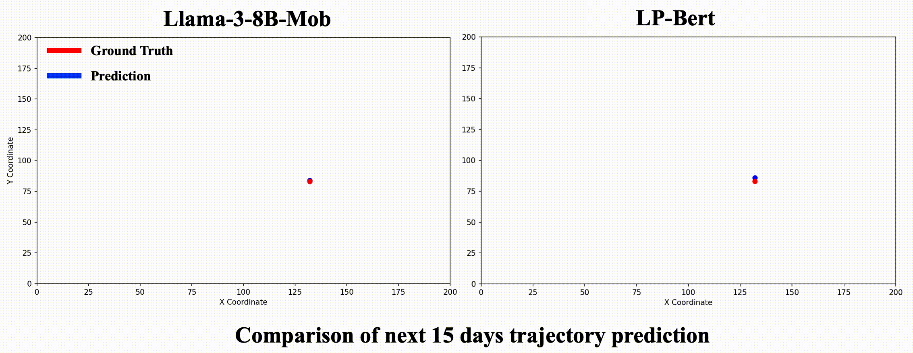

## (HuMob'24 @SIGSPATIAL) Instruction-Tuning Llama-3-8B Excels in City-Scale Mobility Prediction

### 📖 Introduction 
**Llama-3-8B-Mob** is a large language model designed for **long-term human mobility prediction across multiple cities**. Leveraging instruction tuning, it models complex spatial-temporal patterns in human mobility data to predict future trajectories over extended periods. Our model was validated on real-world human mobility data from four metropolitan areas in Japan, showcasing significant improvements over previous state-of-the-art models.

### ⭐ Highlights
- **Instruction-Tuned LLM**: Llama-3-8B-Mob employs instruction-tuning, allowing it to handle mobility prediction in a flexible Q&A format.
- **Long-term Mobility Prediction**: Unlike most models that focus on short-term prediction, Llama-3-8B-Mob excels in predicting individual trajectories up to 15 days in advance.
- **Cross-City Generalization**: Fine-tuned on a single city, Llama-3-8B-Mob demonstrates impressive zero-shot generalization to other cities without needing city-specific data.
- **Top 10 Performance**: The model ranked in the top 10 in the [Human Mobility Prediction Challenge 2024](https://wp.nyu.edu/humobchallenge2024/), outperforming over 100 competing models.

### ▶️ Demo 


### 📦 Dependencies
Dependencies can be installed using the following command:
```
conda create --name test \
    python=3.10 \
    pytorch-cuda=12.1 \
    pytorch cudatoolkit xformers -c pytorch -c nvidia -c xformers \
    -y
conda activate test

pip install "unsloth[colab-new] @ git+https://github.com/unslothai/unsloth.git"
pip install --no-deps trl peft accelerate bitsandbytes 
conda install -y scipy 
pip install wandb
```
### ⚙️ Usage 
To get started with Llama-3-8B-Mob, follow these steps:

1. Download the dataset from the [official source](https://wp.nyu.edu/humobchallenge2024/datasets/), or use a custom dataset with a similar format.
2. data
3. Login your wandb and Try your first own finetuning!
```
python Finetune_Llama3.py
```
4. Evaluate
```
python Evaluate_Llama3.py
```
5. Infer 
```
python main.py --l_idx 1700 --r_idx 1800 --city c &
```

<!-- #### Citation -->